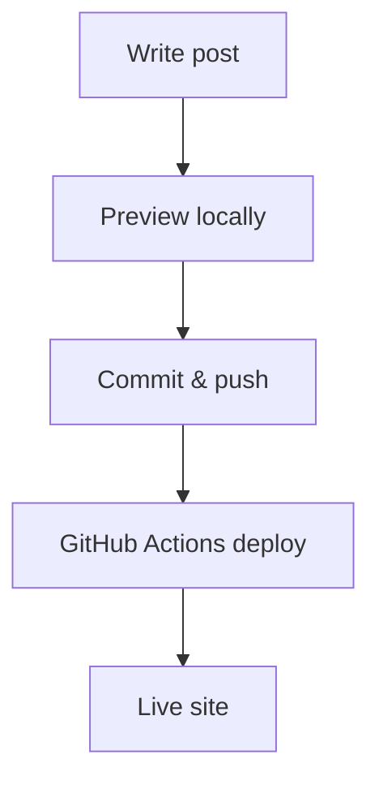

This is a **demo post** to verify your Hugo + PaperMod setup works end-to-end:
- Table of contents (ToC)
- Headings + deep sections
- Lists, quotes, callouts
- Code blocks + inline code
- Tables
- Images (page bundle)
- Collapsible sections
- Footnotes
- (Optional) Math
- (Optional) Mermaid diagrams

---

## 1. Quick Navigation

- Home: `/`
- Posts list: `/posts/`
- Search: `/search/`
- Tags: `/tags/`

---

## 2. Headings and Structure

### 2.1 Short paragraphs
Keep paragraphs short. Use whitespace. Readers love it.

### 2.2 Lists
**Bullets**
- Item A
- Item B
  - Nested item B.1
  - Nested item B.2

**Numbers**
1. Step one
2. Step two
3. Step three

---

## 3. Callouts / Notes

> **Note:** This is a normal Markdown blockquote.  
> You can use this for quick callouts.

> **Tip:** Use concise callouts frequently in long posts.

---

## 4. Collapsible Details

<details>
  <summary>Click to expand: extra notes</summary>

This content is hidden by default.

- Great for long derivations
- Or extra implementation details

</details>

---

## 5. Code Blocks

Inline code looks like `hugo server -D`.

### 5.1 Shell
```bash
hugo server -D
```

### 5.2 Python
```python
def hello(name: str) -> str:
    return f"Hello, {name}!"

print(hello("PaperMod"))
```

### 5.3 JSON
```json
{
  "site": "turuibo.github.io",
  "theme": "PaperMod",
  "features": ["toc", "search", "tags"]
}
```

---

## 6. Tables

| Feature | Works? | Notes |
|---|---:|---|
| TOC | ✅ | `ShowToc` + `TocOpen` |
| Search | ✅ | Requires home JSON output |
| Tags | ✅ | Uses Hugo taxonomy |
| Code | ✅ | Fenced code blocks |
| Images | ✅ | Use page bundle |

---

## 7. Images (Page Bundle)

Put an image at:

`content/posts/2026-01-08-demo-long-post/img/demo.png`

Then reference it like this:


If you don’t have an image yet, this section will show a broken image icon—totally fine until you add one.

---

## 8. Links and Footnotes

A normal link: https://gohugo.io/

A footnote example.[^1]

[^1]: This is a footnote.

---

## 9. Optional Math (only if you enable it)

Inline math: \( \alpha_t, \sigma_t \)

Block math:

$$
x_t = \alpha_t x_0 + \sigma_t \epsilon,\quad \epsilon \sim \mathcal{N}(0, I)
$$

If you see raw `\( ... \)` and `$$ ... $$` on the page, math rendering isn’t enabled yet.

---

## 10. Optional Mermaid Diagram (only if you enable it)



If you see the Mermaid code block as plain text, Mermaid rendering isn’t enabled yet.

---

## 11. Done

If you can read this post and the ToC works, your blog is ready for long-form writing.
