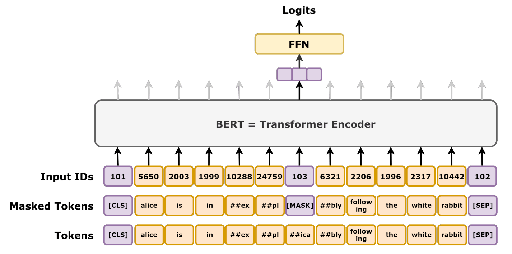
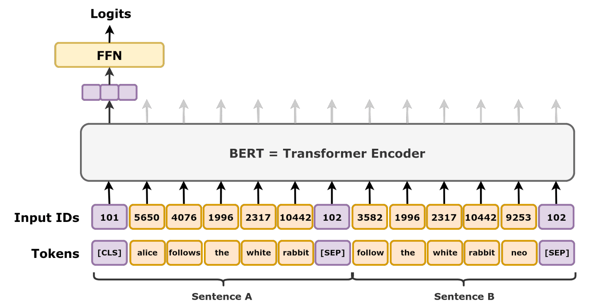

BERT takes the encoder of Transformer ([Vaswani et al., 2017](https://proceedings.neurips.cc/paper_files/paper/2017/hash/3f5ee243547dee91fbd053c1c4a845aa-Abstract.html)) pre-trained with masked language model task and next sentence prediction. It can be finetuned on downstream tasks and achieves state-of-the-art performance. MLM plays an important role in self-supervised learning, and inspired MAE-ViT ([He et al., 2022](https://arxiv.org/abs/2111.06377)). Another important self-supervised learning task is contrastive learning, e.g., used by DINO ([Caron et al., 2021](https://arxiv.org/abs/2104.14294)). While the representation learned with MLM in general requires finetuning for downstream tasks, contrastive learning leads to better zero-shot, few-shot or in-context learning performance. But the simplicity and efficiency of MLM makes it as a compelling method for pretraining.

## Problem

The starting point of BERT is the limitation of left-to-right Transformers, such as GPT ([Radford et al., 2018]). Because first of all, limiting deep learning models is not a good practice, e.g., the invertibility of deep neural network in normalizing flows. Secondly, the left-to-right inductive bias doesn't fit all NLP tasks. Therefore, BERT removes the constraints and allow attention layers to compute attentions across all tokens within a sequence of tokens.

## Model

BERT consists of embedding layers, Transformer blocks, and pre-training task heads, including MLM and NSP.

### Embedding layers

The embedding layer handles three inputs

* Ids of tokens, e.g., 1, 7, 8, ...;
* Positions of tokens in a sequence with maximum length, e.g., 1,..., T;
* Token types, either from the first sentence or the second sentence, e.g., 0,0,0,....,1,1.

For each input, the embedding layer produces a vector as the embedding of which the hidden size is the same for all inputs,  and then sums up all the embedding as the input to the Transformer blocks.

``` python
self.token_embeddings = nn.Embedding(vocab_size, hidden_size)
self.position_embeddings = nn.Embedding(max_position_embeddings, hidden_size)
self.token_type_embeddings = nn.Embedding(type_vocab_size, hidden_size)
```

## Pre-training and Fine-tuning

MLM and NSP are used for pre-training; however, NSP is shown to be less effective when scaling up by adding more data in a batch and more data ([Liu et al., 2019](https://arxiv.org/abs/1907.11692)). From this observation, it is interesting to see the behavior change when scaling up. Simple methods can work better.

**MLM.** Weight tying is used and shown to be effective in language modelling, which uses the transpose of the embedding layer of input tokens as the output layer. It saves the number of parameters and enforce the hypothesis that the output embedding space should be similar as the input embedding space.

**Finetuning.** 
Downstream task heads are added on top of the last layer and all parameters are finetuned. LoRA was not developed at that time and the parameter number is still feasible to be finetuned, like less than 1 billion.


*Figure 1: Masked language modelling tasks. Source: [Wikipedia](https://en.wikipedia.org/wiki/BERT_(language_model)).*


*Figure 2: Next sentence prediction task. Source: [Wikipedia](https://en.wikipedia.org/wiki/BERT_(language_model)).*

## Training recipe

> **Note:** The batch size of 256 is relatively small compared to modern standards (e.g., RoBERTa used 8k). The NSP task was later found to be less critical or even detrimental in subsequent studies like RoBERTa, which removed it and trained on more data for longer.

| Pretraining aspect       | Details                                                                                     |
| ------------------------ | ------------------------------------------------------------------------------------------- |
| Objective                | **Masked Language Model (MLM)** + **Next Sentence Prediction (NSP)**                        |
| Steps                    | **1,000,000 steps**                                                                         |
| Hardware                 | **4 Cloud TPUs** (Base) or **16 Cloud TPUs** (Large)                                        |
| Wall-clock time          | **~4 days** (Base and Large)                                                                |
| Batch size               | **256 sequences**                                                                           |
| Sequence length schedule | **128 tokens for 90%** of steps (**900k**), then **512 tokens for 10%** of steps (**100k**) |
| Tokens per batch         | **256×128 = 32,768** (first phase), **256×512 = 131,072** (second phase)                    |
| Data used                | **BooksCorpus** (800M words) and **English Wikipedia** (2,500M words)                       |
| Optimizer                | **Adam** (β1=0.9, β2=0.999, ε=1e-6)                                                         |
| Learning rate schedule   | **Linear warm-up** over **10k steps**, then **linear decay**; Peak LR **1e-4**              |
| Weight decay             | **0.01** (L2)                                                                               |
| Regularization           | **Dropout** with probability **0.1**                                                        |
| Activation               | **GELU**                                                                                    |

## Discussion

Masked value prediction and removing the constraints on attention layers make the model assumptions hold for other domains, like image, tabular data, time-series data, as well. So regarding general self-supervised learning with finetuning for downstream tasks, it will be more reasonable to start from BERT structure than GPT structure.

## Further Reading

* DINO, the other way of self-supervised learning for representation learning;
* MAE-ViT, the application of MLM in images;
* RoBERTa, scale up BERT with better practices.


## References

* He, K., et al. (2022). [Masked Autoencoders Are Scalable Vision Learners](https://arxiv.org/abs/2111.06377). *CVPR*.
* Caron, M., et al. (2021). [Emerging Properties in Self-Supervised Vision Transformers](https://arxiv.org/abs/2104.14294). *ICCV*.
* Liu, Y., et al. (2019). [RoBERTa: A Robustly Optimized BERT Pretraining Approach](https://arxiv.org/abs/1907.11692). *arXiv*.
* Radford, A., et al. (2018). [Improving Language Understanding by Generative Pre-Training](https://s3-us-west-2.amazonaws.com/openai-assets/research-covers/language-unsupervised/language_understanding_paper.pdf). *OpenAI*.
* Vaswani, A., et al. (2017). [Attention Is All You Need](https://proceedings.neurips.cc/paper_files/paper/2017/hash/3f5ee243547dee91fbd053c1c4a845aa-Abstract.html). *NeurIPS*.
