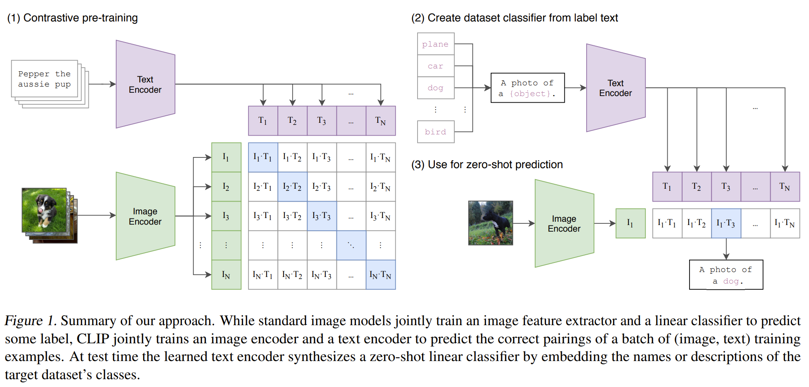
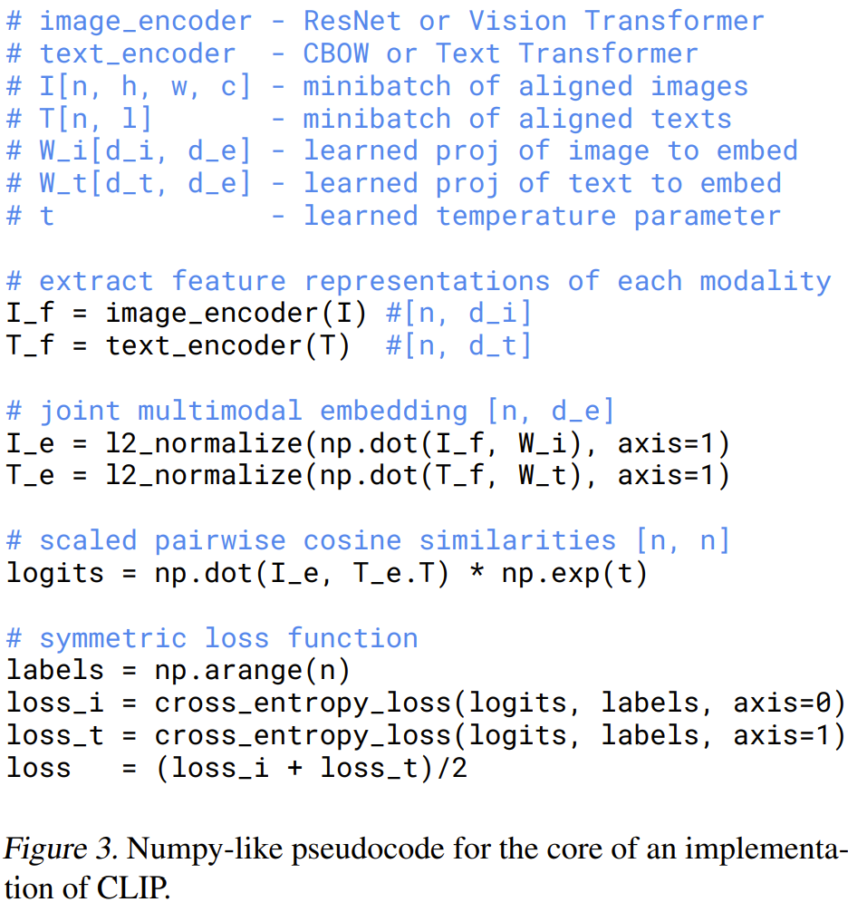
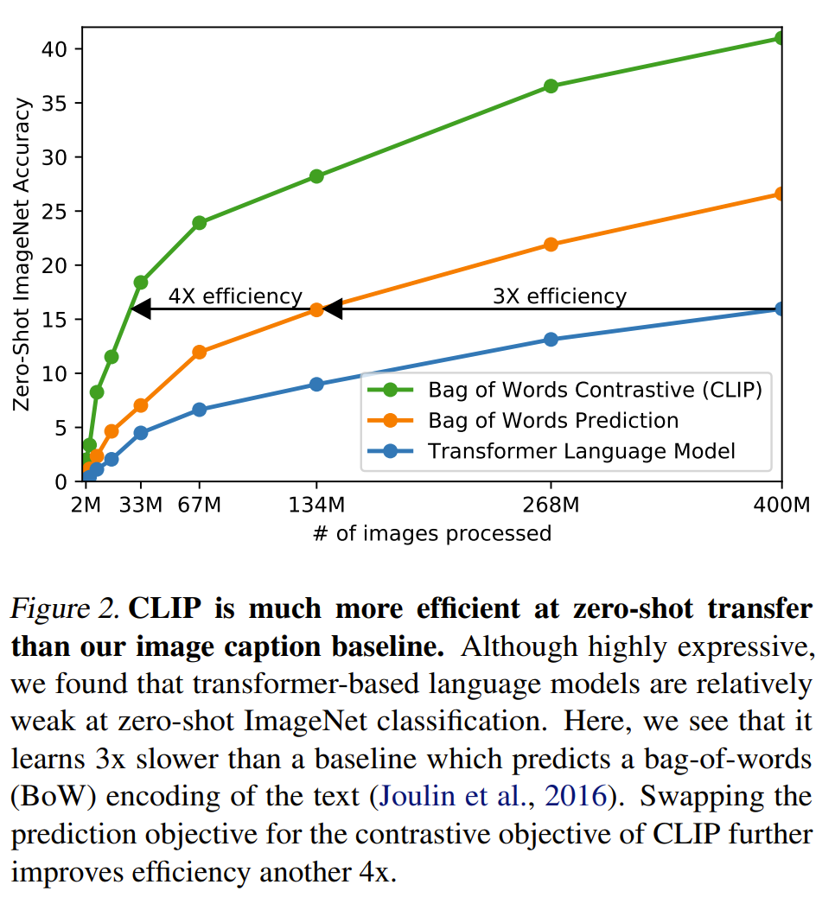
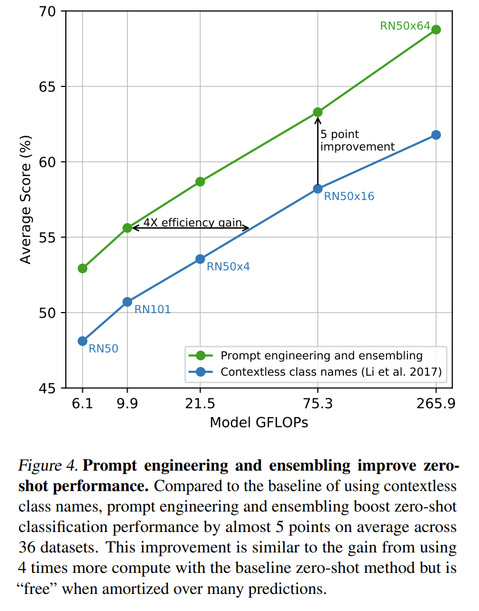

## Overview

Pursuing an efficient way to learn vision representation with natural language supervision, CLIP uses contrastive learning to train a vision encoder and a text encoder. Different from previous works, the pre-training dataset is from web-image-text, which is significantly more than the existed crowded labeled datasets. Moreover, the dataset doesn’t require the gold labels, which enables the scalability. As a result, the image representation can be used for zero-shot transfer tasks, such as ImageNet classification. And the shared multi-modality embedding space enables the analysis between image and text modality.

## Explore the way to achieve zero-shot transfer

Zero-shot transfer is more attractive than finetuning because it requires less computation and is easier to use for applications. So this paper aims high and explore the essential elements to achieve zero-shot transfer for vision representations.

The beginning point given by the paper is to define task-agnostic objectives and architectures. One way is to use natural language as supervision signals. This is similar as GPT in NLP of which the training process covers many tasks implicitly by predicting tokens. Therefore, using natural language as supervision signals is equivalent to training models with multiple tasks at the same time like classification, image to caption, ... Moreover, considering natural language as a way connecting labels with their implicit relationships, the image representation learning can learn vision concepts better.

However, this is not a new idea, why the previous works didn't achieve the goal. The authors state that scale matters. There have been works showing that increasing the number of training data can help improve the model capability. Therefore, instead of using crowd labeled data, web-image-text dataset is created as an important contribution of the work. Then the next task is how to train a model on such a huge dataset.

Recent works find that contrastive learning as a pre-training method has better zero-shot transfer performance than masked value prediction. Moreover, contrastive learning doesn't require as much computation and model complexity as data reconstruction or generation. Especially, for web scale pre-training, contrastive learning provides an efficient solution to train models. Moreover, compared with the other self-supervised learning tasks like text prediction, the contrastive learning task is easier and requires less computation.

In summary, the three elements are to

- use natural language as supervision signals;
- create web-image-text dataset;
- train model efficiently with contrastive learning.

## Model
The embeddings of texts and images have the same dimensionality and their cosine similarity is used for computing the contrastive loss. And there are N positive pairs and N (N-1) negative pairs. After prompting the text template, the CLIP model can be used for classification.

 *source ([Radford et al., 2021](https://arxiv.org/abs/2103.00020))*

  *source ([Radford et al., 2021](https://arxiv.org/abs/2103.00020))*

**Some important insights.** Fig 2 shows that as discussed, using the contrastive loss is more efficient while being effective as an easier task. Fig. 4 shows that using transformers is a better choice for CLIP for both efficiency and effectiveness of zero-shot transfer.

 *source ([Radford et al., 2021](https://arxiv.org/abs/2103.00020))*

  *source ([Radford et al., 2021](https://arxiv.org/abs/2103.00020))*

## Dataset

Some fact about the created dataset
| Aspect                                     | Summary                                                                                             |
| ------------------------------------------ | --------------------------------------------------------------------------------------------------------------------------------------------------------------------------- |
| Dataset name                               | WIT (“WebImageText”)                                                                                                                                                        |
| Size                                       | 400 million (image, text) pairs                                                                                                                                             |
| Where it comes from                        | Collected from a variety of publicly available sources on the Internet                                                                                                      |
| Motivation                                 | Existing paired datasets are too small (e.g., COCO/Visual Genome ~100k) or have sparse/noisy metadata at scale (e.g., YFCC100M after filtering to English natural language) |
| Query set size                             | 500,000 queries                                                                                                                                                             |
| What a “query” is (base list)              | All words occurring at least 100 times in English Wikipedia                                                                                                                 |
| Query expansions                           | (1) Bi-grams with high pointwise mutual information (PMI) (2) Names of Wikipedia articles above a certain search volume (3) WordNet synsets not already included            |
| How queries connect to (image, text) pairs | They search for (image, text) pairs whose associated text contains one of the 500k queries (the paper doesn’t specify the exact text fields beyond calling it “text”)       |
| Balancing / cap per query                  | Approximately class-balanced by including up to 20,000 (image, text) pairs per query                                                                                        |
| Overall text scale                         | Total word count is similar to WebText (used to train GPT-2)                                                                                                                |
## Model configuration
| Group                       | Component                | What they chose/did                            | Key details                                                                                                                                                                                      |
| --------------------------- | ------------------------ | ---------------------------------------------- | ------------------------------------------------------------------------------------------------------------------------------------------------------------------------------------------------ |
| Overall design              | CLIP architecture        | Dual-encoder with a shared embedding space     | Separate **image encoder** and **text encoder**; each produces a feature vector that is **projected** into a joint multi-modal embedding space for similarity learning.                          |
| Image encoder (ResNet path) | Base + upgrades          | Start from ResNet-50 family, but **modify** it | Uses **ResNet-D** improvements and **anti-aliased blur pooling**; replaces standard final pooling with **attention pooling**.                                                                    |
| Image encoder (ResNet path) | Attention pooling        | Transformer-style pooling at the end           | Replaces global average pooling with **a single transformer-style multi-head QKV attention layer** that pools the spatial feature map into one vector.                                           |
| Image encoder (ViT path)    | Vision Transformer       | Alternative image encoder family               | Uses a **ViT** image encoder; adds **LayerNorm** on patch + position embeddings before the transformer plus a slightly different initialization.                                                 |
| Text encoder                | Architecture             | GPT-style Transformer encoder                  | Base configuration: **12 layers**, **width 512**, **8 attention heads** (~**63M** params). Uses GPT-style transformer modifications (Radford et al.-style).                                      |
| Text representation         | Tokenization             | Subword tokens (BPE)                           | **Lowercased BPE**, vocab size **49,152**; max sequence length capped at **76** for efficiency.                                                                                                  |
| Text representation         | Special tokens + pooling | How they get one text vector                   | Text is bracketed with **[SOS]** and **[EOS]**; use the final-layer activation at **[EOS]** as the text feature, then apply **LayerNorm + a linear projection** into the shared embedding space. |
| Text attention              | Masking                  | Causal / masked self-attention                 | Uses **masked self-attention** (keeps option open to initialize from a pretrained LM or add an LM loss later).                                                                                   |
| Scaling strategy            | ResNet scaling           | EfficientNet-like “compound” scaling           | Scale **width, depth, and input resolution together** (roughly evenly) for ResNet image encoders.                                                                                                |
| Scaling strategy            | Text scaling             | Keep text smaller; mostly scale width          | Mostly scale **text encoder width** in proportion to the ResNet width; **don’t scale depth** much because results were less sensitive to text capacity.                                          |

## Training recipe
| Group                        | Recipe component                  | What they did                                  | Key details / numbers                                                                                                                                   |
| ---------------------------- | --------------------------------- | ---------------------------------------------- | ------------------------------------------------------------------------------------------------------------------------------------------------------- |
| Models trained               | Model families                    | Trained multiple ResNet and ViT image encoders | **ResNets (5):** RN50, RN101, RN50x4, RN50x16, RN50x64. **ViTs (3):** ViT-B/32, ViT-B/16, ViT-L/14.                                                     |
| Training length & resolution | Epochs                            | Fixed-length training for all models           | **32 epochs** for all models.                                                                                                                           |
| Training length & resolution | High-res “extra” epoch (ViT-L/14) | Small resolution “boost” at the end            | For **ViT-L/14**, run **1 extra epoch at 336px** (often written **ViT-L/14@336px**, FixRes-style).                                                      |
| Optimization                 | Optimizer                         | Adam with decoupled weight decay               | **AdamW-style** (decoupled weight decay). Apply weight decay to weights **but not** to **biases** or **gain** parameters.                               |
| Optimization                 | LR schedule                       | Smooth decay schedule                          | **Cosine learning-rate decay**.                                                                                                                         |
| Optimization                 | Temperature (τ) handling          | Stabilize contrastive logit scaling            | Initialize temperature equivalent to **0.07** and **clip** scaling so logits aren’t multiplied by more than **100**.                                    |
| Batch & compute              | Batch size                        | Use very large global batches                  | Global batch size **32,768**.                                                                                                                           |
| Hyperparameter selection     | How they tuned                    | Tune small first, then scale heuristically     | **Grid + random search + manual tuning** on **RN50 for 1 epoch**, then **heuristically adapt** hyperparameters for larger models due to compute limits. |
| Systems & efficiency         | Precision                         | Mixed precision training                       | Use **mixed precision**.                                                                                                                                |
| Systems & efficiency         | Memory-saving tricks              | Make huge batch + big models feasible          | **Gradient checkpointing**, **half-precision Adam statistics**, and **half-precision (stochastically rounded) text-encoder weights**.                   |
| Distributed training         | Similarity computation            | Scale contrastive loss to huge batch           | Pairwise similarity computation is **sharded across GPUs**; each GPU computes only what it needs for its local batch.                                   |
| Reported training runs       | Wall-clock examples               | Shows training scale                           | Example figures: **RN50x64 ~18 days on 592 V100s**; largest **ViT ~12 days on 256 V100s**.                                                              |

## References
* Radford, A., et al. (2021). [Learning Transferable Visual Models From Natural Language Supervision](https://arxiv.org/abs/2103.00020). *ICML*.
