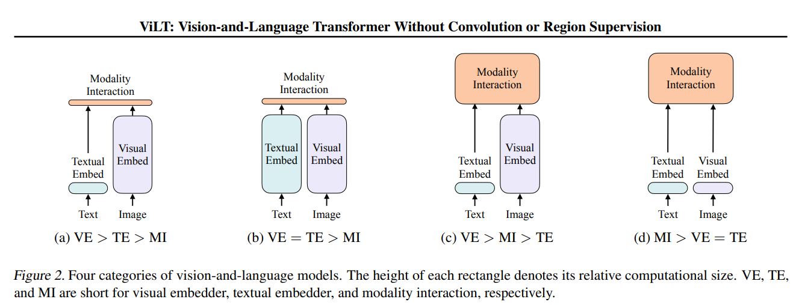

## Overview
A collection of vision-language models.

An aspects of vision-language models:

 *source ([Kim, W., et al., 2021)](https://arxiv.org/pdf/2102.03334))*

## References
* Yu, J., Wang, Z., Vasudevan, V., Yeung, L., Seyedhosseini, M., & Wu, Y. (2022). [CoCa: Contrastive Captioners are Image-Text Foundation Models](https://arxiv.org/abs/2205.01917). *arXiv*. 
* Li, J., et al. (2021). [ALBEF: Align before Fuse: Vision and Language Representation Learning with Momentum Distillation](https://arxiv.org/abs/2107.07651). *NeurIPS*. 
* Alayrac, J.-B., et al. (2022). [Flamingo: a Visual Language Model for Few-Shot Learning](https://arxiv.org/abs/2204.14198). *NeurIPS*.
* Chen, J., et al. (2022). [VisualGPT: Data-Efficient Adaptation of Pretrained Language Models for Image Captioning](https://openaccess.thecvf.com/content/CVPR2022/html/Chen_VisualGPT_Data-Efficient_Adaptation_of_Pretrained_Language_Models_for_Image_Captioning_CVPR_2022_paper.html). *CVPR*.
* Li, J., et al. (2022). [BLIP: Bootstrapping Language-Image Pre-training for Unified Vision-Language Understanding and Generation](https://arxiv.org/abs/2201.12086). *arXiv*.
* Li, J., et al. (2023). [BLIP-2: Bootstrapping Language-Image Pre-training with Frozen Image Encoders and Large Language Models](https://arxiv.org/abs/2301.12597). *arXiv*.
* Xue, L., et al. (2024). [xGen-MM (BLIP-3): A Family of Open Large Multimodal Models](https://arxiv.org/abs/2408.08872). *arXiv*.
* Yu, J., et al. (2022). [CoCa: Contrastive Captioners are Image-Text Foundation Models](https://arxiv.org/abs/2205.01917). *arXiv*.
* Bai, J., et al. (2023). [Qwen-VL: A Versatile Vision-Language Model for Understanding, Localization, Text Reading, and Beyond](https://arxiv.org/abs/2308.12966). *arXiv*.
* Liu, H., et al. (2023). [Visual Instruction Tuning](https://arxiv.org/abs/2304.08485). *arXiv*.
* Kim, W., et al. (2021). [ViLT: Vision-and-Language Transformer Without Convolution or Region Supervision](https://arxiv.org/abs/2102.03334). *ICML*.
