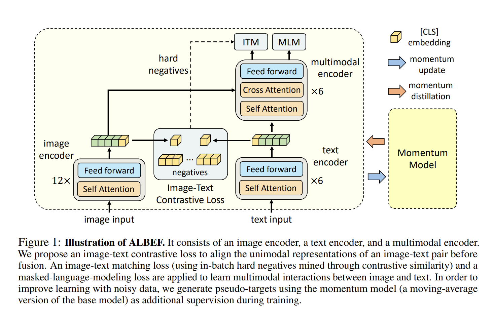
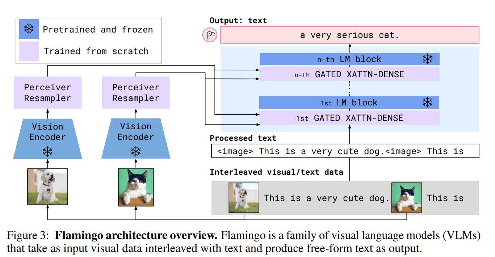
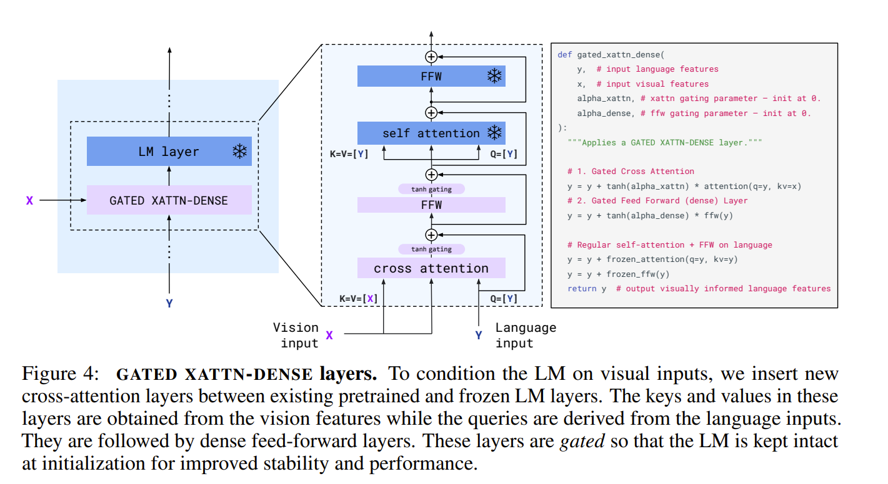
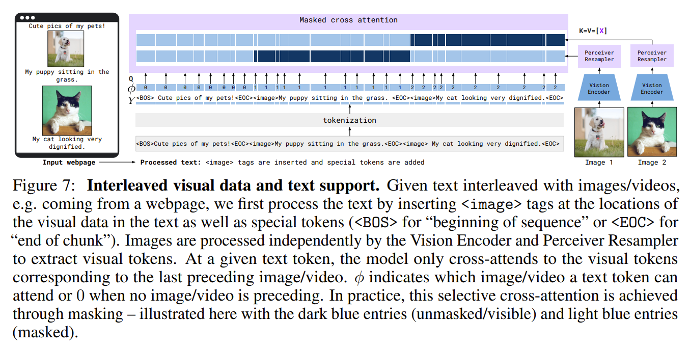
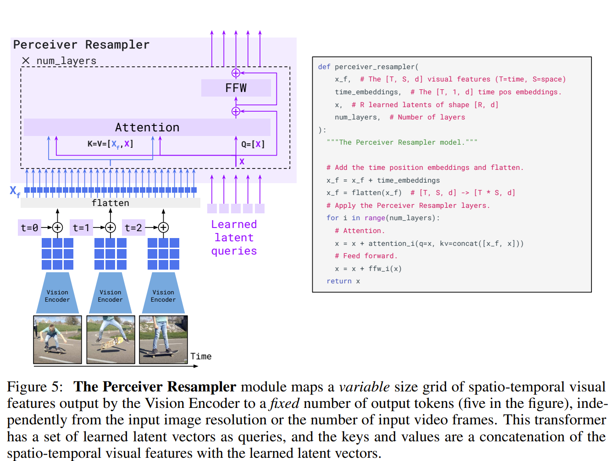
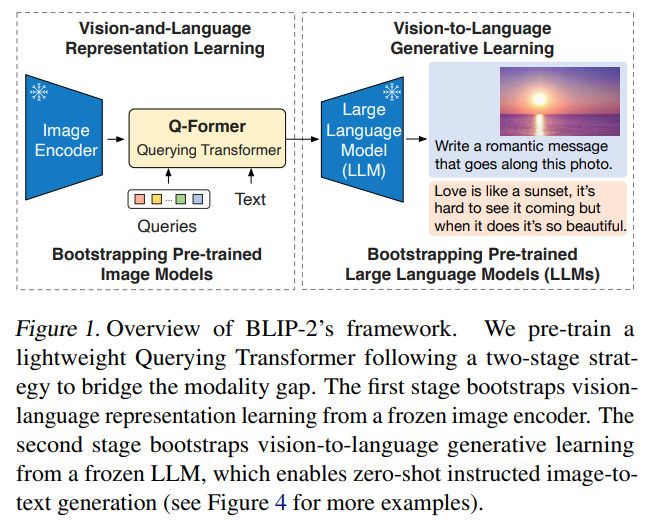
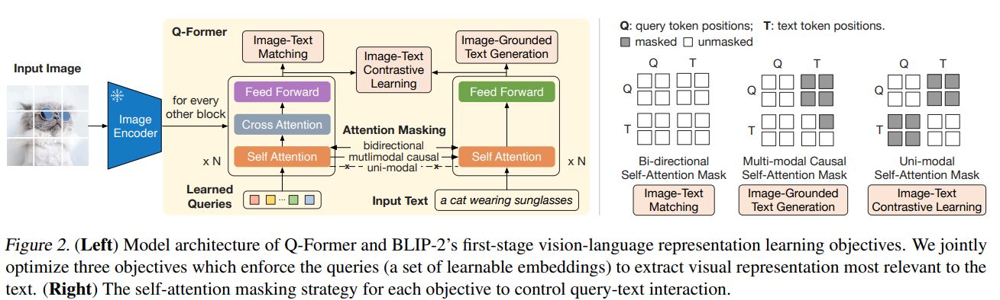

## Overview

This post takes a look at vision-language models (VLMs) and their evaluation and focuses on models fusing vision and language modality with cross-attention. Models with fusing mechanisms are commonly:

* Dual-encoder: CLIP (also ALIGN, etc.)
* Fusion-encoder (cross-encoder / hybrid): ALBEF (also UNITER/ViLT-style)
* Encoder–decoder: models that explicitly encode vision then decode text (SimVLM-style; OFA is often framed as unified seq2seq)
* Unified transformer: BLIP, OFA-style
* Multimodal LLM with cross-attention adapters: Flamingo
* Hybrid dual-encoder + captioner: CoCa

Common tasks of VLMs are:

* image-text retrieval;
* visual question answering;
* visual reasoning;
* captioning;
* visual entailment;
* weakly-supervised grounding.

## Models

### ALBEF ([Li et al., 2021](https://arxiv.org/abs/2107.07651))
This paper summarizes the related work in two categories regarding multi-modal modelling.

1. joint vision-language encoders with cross-attention for complex reasoning;
2. separate uni-modal encoders, like CLIP, for simple tasks like image-text retrieval.

ALBEF proposes to combine both categories of models with Image-Text Contrastive learning (ITC), Masked Language Modelling (MLM) and Image-Text Matching (ITM) objectives. Moreover, it proposes to use two important approximations with queuing memory bank ([He et al., 2020](https://arxiv.org/abs/1911.05722)) and soft labels. As a result, it can use 8xA100 GPUs for 30 epochs of batch size 512.

As shown in Fig 1, the objectives are applied to both individual encoders before using cross-attention and to the final representation after using cross-attention.
It worths to note that contrastive learning requires large number of negative samples, like a huge batch in CLIP. Using memory bank saves computes by re-using the outputs from previous calls of teacher models as the approximation of the outputs of the current student model. Moreover, to handle the noisy labelling of web data, a mix of soft labels from teacher models and labels by annotators are used for training.

 *source ([Li et al., 2021](https://arxiv.org/abs/2107.07651))*

Details: Memory bank, knowledge distillation

### CoCa ([Yu et al., 2022](https://arxiv.org/abs/2205.01917))

### Flamingo ([Alayrac et al., 2022](https://arxiv.org/abs/2204.14198))

Flamingo transform pre-trained visual and language models into visual conditioned text generation model. It has three key highlighted modules: perceiver io for unifying video and image data; gated cross-attention for conditioning text generation on visual features with ordered masks and causal masks; enormous collected training data. It claims a few contributions:

* sustainability: leverage pre-trained vision-only models and language only models (preserves the knowledge accumulated during pre-training: gated cross-attention);
* flexibility: arbitrarily inter-leaved visual and textual data(rich interleaved web data + masked cross-attention computing with representing this type data properly)
* compatability: ingests images or videos as inputs (perceiver resampler)

A visual conditioned text generation model based on frozen encoders. Given a frozen-weight pre-trained visual encoder (NFNet) and a language model (Chinchillas), a perceiver resampler and cross attention layers are introduced by Flamingo as show in Fig. flamingo-1. Perceiver resampler unifies visual inputs, images and video data. It first takes the flattened visual features and outputs fixed length processed features. Moreover, between every two blocks, a gated cross-attention layer is introduced. The gating mechanism makes sure not change the language model outputs initially. Furthermore, to cooperate interleaved images and texts, the images are masked differently for computing cross-attention scores following a pre-defined rule.

*Fig. flamingo-1. Moduels of Flamingo model. Visual encoder, Perceiver resampler, gated cross-attention layers.*

**Important details about modules: cross-attention layers.**
To capture the position of images relative to texts, $\phi$ coding numbers are assigned for each token for their visible images when computing cross-attention scores.

**Perceiver Resampler.**

The learned latent queries extract information from input features which start from random tensors to representations as conditional signal to language models.

**Paradigms: zero-shot, few-shot, and finetuning paradigms.**
A famous zero-shot transfer model, CLIP, is good for closed-ended tasks, e.g., classification, but these models perform worse on open-ended tasks like VQA require more complex reasoning abilities. So further efforts on VLMs are in need. ([Radford et al., 2021](https://arxiv.org/abs/2103.00020))
Flamingo compares finetuning with few-shots learning when few data are available. It states that finetuning still requires computation resources and per-task hyperparameter tuning, which is less ideal compared with few-shot learning. But few-shot learning requires computations during inference time and may achieve the upper limit of performance. Compared with zero-shot, few-shot learning can regularize the output formats by showing examples.

**Perception IO**
It is both an architecture significance but also the bottleneck on how much information can be effectively compressed by Perciever IO. ([Jaegle et al., 2021](https://arxiv.org/abs/2107.14795))

**512 TPUs for a sustainable work are too expensive**
A few more amazing facts:

* it collects even larger datasets;
* it retrains a few CLIP models

Why Flamingo still requires a big number of TPUs?

* Forward pass still needs all parameters in TPUs;
* The training loss is over all datasets.
  
**Following up competing models.**

- **2025**
  - [Qwen2.5-VL](https://arxiv.org/abs/2502.13923)
  - [InternVL3](https://arxiv.org/abs/2504.10479)
  - [InternVL3.5](https://arxiv.org/abs/2508.18265)
  - [Baichuan-Omni-1.5](https://arxiv.org/abs/2501.15368)
  - [Kimi-VL](https://arxiv.org/abs/2504.07491)
  - [Kwai Keye-VL](https://arxiv.org/abs/2507.01949)
  - [REF-VLM](https://arxiv.org/abs/2503.07413)

- **2024**
  - [Chameleon](https://arxiv.org/abs/2405.09818)
  - [PaLI-3](https://arxiv.org/abs/2310.09199)
  - [Emu](https://arxiv.org/abs/2307.05222)
  - [Emu2](https://arxiv.org/abs/2312.13286)
  - [Qwen2-VL](https://arxiv.org/abs/2409.12191)
  - [Cambrian-1](https://arxiv.org/abs/2406.16860)
  - [Pixtral 12B](https://arxiv.org/abs/2410.07073)
  - [Aria](https://arxiv.org/abs/2410.05993)

- **2023 (still commonly listed as “post-Flamingo” baselines)**
  - [PaLM-E](https://arxiv.org/abs/2303.03378)
  - [PaLI-X](https://arxiv.org/abs/2305.18565)
  - [BLIP-2](https://arxiv.org/abs/2301.12597)
  - [InstructBLIP](https://arxiv.org/abs/2305.06500)
  - [Qwen-VL](https://arxiv.org/abs/2308.12966)
  - [LLaVA-1.5](https://arxiv.org/abs/2310.03744)
  - [IDEFICS](https://arxiv.org/abs/2306.16527)
  - [Kosmos-2](https://arxiv.org/abs/2306.14824)

Let's have a series called the crazy big worlds for the flagship models, like BLIP, QwenVL, InternVL, Kimi-VL, LlaVa, PaLI.

### BLIP-2 ([Li et al., 2023](https://arxiv.org/abs/2301.12597))

**A continual learning view of VLMs.** A scenario of VLMs is that given a working LLM, we want to empower it with visual reasoning capabilities. One way is to train from scratch by considering image patch tokens and text tokens at the same level, which is expensive and requires changes of training processes. Another way is to extend the capability of LLMs and make them "continual learning" on visual tasks. Following the later idea, one continual learning methodology is architecture-based. We don't want the limited capability of existing models lead to catastrophic forgetting; hence, augmenting existing LLMs is in need. Flamingo applied visual encoders with Perceiver resampler extracting relevant visual information and added gated cross-attention layers in-between LLMs. BLIP 2 claimed that this is an expensive way. BLIP 2 uses a similar representation learning trick with transformers as Perceiver resampler, that takes texts and images as input and provides representation including both information. Such representation is transformed and used as a prepended embedding of LLMs for generating answers.

**A conditional generation view of VLMs.** Given an image encoder and a LLM, the image encoder provides features as conditional signals for the LLM such that the LLM can provide answers for the given query about the image. Flamingo filled in the gap by cross-attention layers and transformer-based visual representation learning. Moreover, different from previous dual-encoder, encoder-decoder methods in fusing VLMs, BLIP-2 proposes a stand-alone transformer for bridging the visual and language model gaps. The same as Flamingo, image encoders provide visual features and LLMs provide final answers.

*Fig.blip2. BLIP-2 uses Q-Former to fill in the gap between visual and language pre-trained models. **This figure is not the same for using BLIP 2 which takes text input by the LLM not by Q-Former**.*

**Sustainability.** BLIP-2 motivated in the following way. Pre-training models have high computational cost. Especially for VLMs, reusing out-of-the-shelf pre-trained models while freezing parameters is a compelling way but challenging. Because language and image encoders are trained separately. Their embedding spaces are disconnected. Similar concepts in the language embedding space are not necessary similar in the visual space. Therefore, augmenting the embedding space and model capabilities is still an open question.

**Q-Former.**

*Fig.blip2_qformer. The 1st stage of Q-Former based on a pre-trained BERT.*

*Fig.blip2_qformer. The 2nd stage of Q-Former.*

The Q-Former takes learned queries and query texts as input and provides representation based on learned queries for LLMs. It is based on a pre-trained BERT and uses cross-attention layers to extract visual information from visual encoder features. Moreover, different masks are used for computing the objectives of training the stage-1 Q-Former.

**Two-stage training.**
The two-stage manner turns a BERT into an alignment model to fill in the gap step by step. The first stage contains three objectives: image-text contrastive learning (similar as CLIP, given an image, find the winning text against the rest texts); image-text matching (whether it is a paired image-text or not); image-grounded text generation (captioning). The captioning task is not so BERT, but the purpose at this stage is not to get a perfect captioning model, instead to get a good enough visual information extractor. The text and the objectives are supporting to have a better representation from learned queries. Then the second stage takes the linear transformed representation as prepended embeddings of text embeddings and further finetune the Q-Former.

### BLIP
https://arxiv.org/pdf/2201.12086

### Instruct BLIP
https://arxiv.org/pdf/2305.06500

## Non-fusion models

### ClipCap

### SimVLM 

(Simple Visual Language Model; Wang et al. 2022) is a simple prefix language model, where the prefix sequence is processed with bi-directional attention like BERT, but the main input sequence only has causal attention like GPT.

## Evaluation: tasks, datasets, performance

tasks: VQA, captioning, multiple-choice VQA
type: zero-shot, few-shot

## References
* Yu, J., Wang, Z., Vasudevan, V., Yeung, L., Seyedhosseini, M., & Wu, Y. (2022). [CoCa: Contrastive Captioners are Image-Text Foundation Models](https://arxiv.org/abs/2205.01917). *arXiv*. 
* Li, J., et al. (2021). [ALBEF: Align before Fuse: Vision and Language Representation Learning with Momentum Distillation](https://arxiv.org/abs/2107.07651). *NeurIPS*. 
* Alayrac, J.-B., et al. (2022). [Flamingo: a Visual Language Model for Few-Shot Learning](https://arxiv.org/abs/2204.14198). *NeurIPS*.
* Chen, J., et al. (2022). [VisualGPT: Data-Efficient Adaptation of Pretrained Language Models for Image Captioning](https://openaccess.thecvf.com/content/CVPR2022/html/Chen_VisualGPT_Data-Efficient_Adaptation_of_Pretrained_Language_Models_for_Image_Captioning_CVPR_2022_paper.html). *CVPR*.
* Li, J., et al. (2022). [BLIP: Bootstrapping Language-Image Pre-training for Unified Vision-Language Understanding and Generation](https://arxiv.org/abs/2201.12086). *arXiv*.
* Li, J., et al. (2023). [BLIP-2: Bootstrapping Language-Image Pre-training with Frozen Image Encoders and Large Language Models](https://arxiv.org/abs/2301.12597). *arXiv*.
* Xue, L., et al. (2024). [xGen-MM (BLIP-3): A Family of Open Large Multimodal Models](https://arxiv.org/abs/2408.08872). *arXiv*.
* Yu, J., et al. (2022). [CoCa: Contrastive Captioners are Image-Text Foundation Models](https://arxiv.org/abs/2205.01917). *arXiv*.
* Bai, J., et al. (2023). [Qwen-VL: A Versatile Vision-Language Model for Understanding, Localization, Text Reading, and Beyond](https://arxiv.org/abs/2308.12966). *arXiv*.
* Liu, H., et al. (2023). [Visual Instruction Tuning](https://arxiv.org/abs/2304.08485). *arXiv*.
* Kim, W., et al. (2021). [ViLT: Vision-and-Language Transformer Without Convolution or Region Supervision](https://arxiv.org/abs/2102.03334). *ICML*.
* Radford, A., et al. (2021). [Learning Transferable Visual Models From Natural Language Supervision](https://arxiv.org/abs/2103.00020). *ICML*.
* Jaegle, A., et al. (2021). [Perceiver IO: A General Architecture for Structured Inputs & Outputs](https://arxiv.org/abs/2107.14795). *ICML*.
* He, K., et al. (2020). [Momentum Contrast for Unsupervised Visual Representation Learning](https://arxiv.org/abs/1911.05722). *CVPR*.
