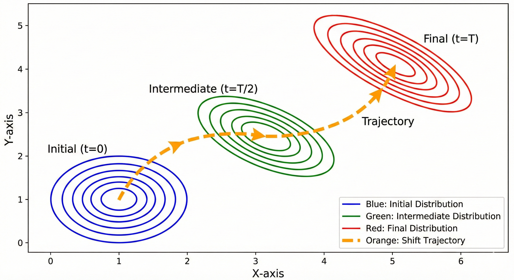

Talking about continual learning, very likely we may talk about different things, like AGI. It can be

* the post-training of LLM;
* self-evolve agents;
* experience replay in DQN ([Mnih et al., 2013](https://arxiv.org/abs/1312.5602));
* sequential learning of MNIST digits;
* optimal order of learning tasks, ...

For a better conversation, this post aims at bringing back the context of continual learning in deep learning, positioning it together with other learning regimes, show the definition, evaluation, and solutions without technical details. Moreover, discuss the connection and inspiration for LLMs and foundation models. This post is inspired by ([Mundt et al., 2023](https://arxiv.org/abs/2009.01797)).

## Context

We are in the era of foundation models. Foundation models are often large and specified at the beginning. A popular way of training such models is to train from scratch between versions, like DINO ([Caron et al., 2021](https://arxiv.org/abs/2104.14294)) and CLIP ([Radford et al., 2021](https://arxiv.org/abs/2103.00020)). Does it have to be in this way? We may want to ask

* Can they evolve by themselves?
* Can they keep learning without from scratch?
* Can they use the learned knowledge to help learn from new data?
* Can they characterize new data as a ratio from known to unknown for update with a better plan like accumulating data for new knowledge until enough for training, update learned knowledge based on relevance and importance of new data?

Besides this technical aspect, we are looking for models that can keep learning with new data and expanding their capabilities of new tasks. However, the learning regime suffers from catastrophic forgetting, that deep learning models forget what learned before while learning from new data and new tasks. When we expect the model to accumulate knowledge and experiences, the forgetting is catastrophic. But catastrophic forgetting is the natural consequence of deep learning when the data distribution is shifted.

*Figure 1: Catastrophic forgetting can be ideal. A data distribution is shifting from time 0 to time T. If T represents the current scenarios, an idea behavior should make models forget at time 0 and focus on time T.*

Moreover, new data and tasks can be conflicting with the old ones that makes the learning task challenging. In theory, we assume that test and training data distributions are the same. But in practice, they can always be different to some extent. Techniques that mitigate the discrepancy well for LLMs and foundation models are needed.

Furthermore, how could we understand the current useful techniques in LLMs and foundation models, Mixture of Experts (MoEs ([Shazeer et al., 2017](https://arxiv.org/abs/1701.06538))), gating mechanisms (like in Qwen ([Qiu et al., 2025](https://arxiv.org/abs/2505.06708))), RL-based post-training, EMA (like in DINO), synthetic data as training data (in TabPFN ([Hollmann et al., 2023](https://arxiv.org/abs/2207.01848))).

## Definition (vs other paradigms)

* Transfer Learning
* Multi-task Learning
* Online Learning
* Few-shot Learning
* Curriculum Learning
* Active Learning
* missing meta learning in-context learning

## Evaluation

**Datasets.** Common benchmarks for continual learning of deep learning models are the modified MNIST, CIFAR-10, imageNet, that are used for constructing tasks and streaming new data over time. ([Mundt et al., 2023](https://arxiv.org/abs/2009.01797)) this paper also claims to use more realistic real open world datasets for measuring better the forgetting.

**Metrics.**

* Overall performance: measures how well a model perform over all tasks over time, like the average accuracy over tasks over time;
* Forgetting metric: measures how much a model forgets about a task when learning new tasks over time, like the performance drop of tasks over time;
* Other aspects: memory consumption, model size, robustness.

## Categories of methods

There are mainly three categories for continual learning of deep learning methods before LLMs.

**Architecture-based.**

**Experience replay-based.**

**Regularization-based.**

**Relation to LLM.**

## Lessons from the past

([Mundt et al., 2023](https://arxiv.org/abs/2009.01797)) summarizes the lessons.

> Forgotten lesson 1: Machine learning models are by definition trained in a closed world, but real-world deployment is not similarly confined. Discriminative neural networks yield overconfident predictions on any sample.
> Forgotten lesson 2: Uncertainty is not predictive of the open set. Active learning resides in an open world and common heuristics based query mechanism are susceptible to meaningless or uninformative outliers.
> Forgotten lesson 3: Confidence or uncertainty calibration, as well as explicit optimization of negative examples can never be sufficient to recognize the limitless amount of unknown unknowns.
> Forgotten lesson 4: Data and task ordering are essential. Although this forms the quintessence of active learning it is yet untended to in continual learning.

## Discussion

**Boundary of tasks and hallucination (over-confidence).** The boundary of tasks becomes less clear in NLP tasks. Because many of them can be formulated as sequence-to-sequence task and LLMs have be trained on such tasks during the pre-training phase with predicting next tokens. Thus, a unique and distinguishing point for LLMs is that a new task can very likely be formulated as the old tasks, and the tasks share certain common knowledge but not all. For example, the new task is coding and pre-training data are from web-text data. The pre-training data can cover the data of the new task but the distribution can be different from or insufficient for the test scenarios. (As same as deep learning models, LLMs are over confident in such scenarios.) In this case, active learning aims at querying the data for gaining the most information about the test data distribution and RL finetunes the model w.r.t the test task by interacting with the test environment.

**Updating the known and learning unknown knowledge.**
Considering the knowledge as the representation and parameters of neural networks, updating the known knowledge and learning unknown knowledge mean updating parameters. When new data coming, different strategies can be applied if we can be characterized whether the data belong to known knowledge or unknown knowledge. But this is non-trivial, considering that anomaly detection and out-of-distribution detection are still active research areas. And data-centric AI ([Zha et al., 2023](https://arxiv.org/abs/2303.10158)) covers such task. 

**Memory and replay for LLMs continual learning.** Before LLMs get popular in machine learning, continual learning studies in deep learning faced the challenge of data privacy. The situation gets different in LLM studies and applications. For example, one can separate pre-trained LLMs from user data with RAG ([Lewis et al., 2020](https://arxiv.org/abs/2005.11401)). From this perspective, it is interesting to see how post-training and finetuning leverage memory, RAG, and replay for continual learning.

## References

* Qiu, Z., et al. (2025). [Gated Attention for Large Language Models: Non-linearity, Sparsity, and Attention-Sink-Free](https://arxiv.org/abs/2505.06708). *NeurIPS*.
* Hollmann, N., et al. (2023). [TabPFN: A transformer that solves small tabular classification problems in a second](https://arxiv.org/abs/2207.01848). *ICLR*.
* Mundt, M., et al. (2023). [A Wholistic View of Continual Learning with Deep Neural Networks: Forgotten Lessons and the Bridge to Active and Open World Learning](https://arxiv.org/abs/2009.01797). *Neural Networks*.
* Zha, D., et al. (2023). [Data-centric Artificial Intelligence: A Survey](https://arxiv.org/abs/2303.10158). *arXiv*.
* Caron, M., et al. (2021). [Emerging Properties in Self-Supervised Vision Transformers](https://arxiv.org/abs/2104.14294). *ICCV*.
* Radford, A., et al. (2021). [Learning Transferable Visual Models From Natural Language Supervision](https://arxiv.org/abs/2103.00020). *ICML*.
* Lewis, P., et al. (2020). [Retrieval-Augmented Generation for Knowledge-Intensive NLP Tasks](https://arxiv.org/abs/2005.11401). *NeurIPS*.
* Shazeer, N., et al. (2017). [Outrageously Large Neural Networks: The Sparsely-Gated Mixture-of-Experts Layer](https://arxiv.org/abs/1701.06538). *ICLR*.
* Mnih, V., et al. (2013). [Playing Atari with Deep Reinforcement Learning](https://arxiv.org/abs/1312.5602). *arXiv*.
